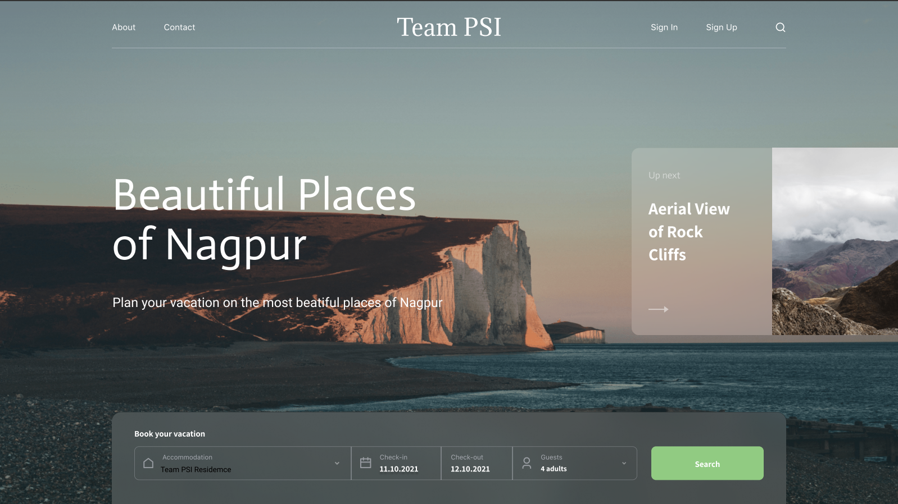

# Web-I-O-Travel Blog using Figma

### Link for the Design created using Figma:

>Click here to view in Figma:- [Team PSI Travel Blog](https://www.figma.com/file/NjBykXpOH6nZ43kTtQNKLv/Team-PSI-Travel-blog?node-id=0%3A1)

>Click here to view as PDF:- [Team PSI Travel Blog](Team_PSI_Travel_blog.pdf) (PDF)

---

### Week-3 Editor Used:

- [Figma Editor](https://www.figma.com/)

---

## Team Psi

>- [Hrugved Kolhe](https://github.com/hrugved06)
>- [Flewin Dsouza](https://github.com/flewindsouza)
>- [Ashish Kotecha](https://github.com/ashishkotecha)
>- [Paresh Chaudhari](https://github.com/PaareshC)

---

### Blog Preview

---